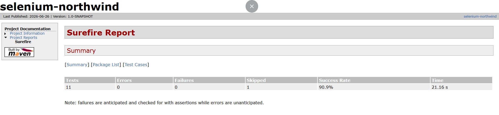
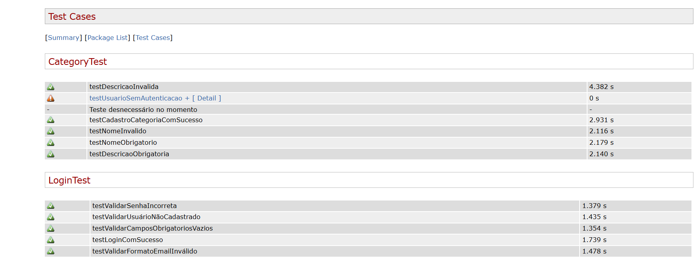

# 🧪 selenium-northwind


> Projeto de automação de testes web desenvolvido com **Selenium 4**, **Java** e **JUnit 5**, aplicado sobre uma plataforma real de gestão de produtos com frontend hospedado na Vercel, API Node.js e banco de dados Supabase.

---

## 📋 Índice

- [Sobre o Projeto](#-sobre-o-projeto)
- [Stack Utilizada](#-stack-utilizada)
- [Pré-requisitos](#-pré-requisitos)
- [Como Executar](#-como-executar)
- [Estrutura do Projeto](#-estrutura-do-projeto)
- [Evidências](#-evidências)
- [Relatório de Testes](#-relatório-de-testes)
- [Autor](#-autor)

---

## 💡 Sobre o Projeto

Este projeto nasceu com um objetivo claro: **aprender automação de testes web aplicando em um cenário real**, não em um formulário genérico de demonstração.

A aplicação testada é uma plataforma de gestão de produtos com frontend em React, API Node.js e banco Supabase — tudo hospedado na Vercel. Isso aproxima os testes de um ambiente profissional de verdade, com comportamentos reais de autenticação, manipulação de dados e feedback visual ao usuário.

### O que foi testado?

| Módulo | Cenários cobertos |
|---|---|
| 🔐 Login | Acesso válido, credenciais inválidas, campo em branco |
| 📦 Produtos | Cadastro, listagem e exclusão |
| 🗂 Categorias | Listagem e validação de dados |

### Por que esse projeto importa?

- Utiliza **Selenium Manager** nativo do Selenium 4 — sem configuração manual de driver
- Aplica **IA na geração e revisão de casos de teste**, demonstrando o uso crítico de ferramentas modernas
- Gera **evidências automáticas em falha** via screenshot
- Produz **relatórios HTML** com Maven Surefire, prontos para compartilhamento
- Toda a estrutura foi construída com foco em **clareza e reutilização**, usando uma BaseTest sem Page Object, ideal para quem está aprendendo

---

## 🛠 Stack Utilizada


| Tecnologia | Função no projeto |
|---|---|
| **Java JDK 25** | Linguagem principal dos testes |
| **Selenium 4.x** | Automação do navegador (com Selenium Manager) |
| **JUnit 5** | Framework de testes e ciclo de vida (`@BeforeEach`, `@AfterEach`) |
| **Maven + Surefire** | Build, dependências e geração de relatórios HTML |
| **IntelliJ IDEA** | IDE utilizada no desenvolvimento |
| **Katalon Recorder** | Apoio na inspeção e gravação inicial de fluxos |
| **Azure DevOps** | Gerenciamento de tarefas e rastreabilidade dos testes |
| **Logback** | Logging estruturado durante a execução |
| **Git + GitHub** | Controle de versão e hospedagem do código |

---

## ✅ Pré-requisitos

Antes de executar o projeto, certifique-se de ter instalado:

- [Java JDK 25+](https://jdk.java.net/25/)
- [Apache Maven 3.8+](https://maven.apache.org/download.cgi)
- [Google Chrome](https://www.google.com/chrome/) (versão atual)
- [IntelliJ IDEA Community](https://www.jetbrains.com/idea/download/) *(opcional, para abrir o projeto pela IDE)*
- [Git](https://git-scm.com/)

> 💡 O **Selenium Manager** (incluído no Selenium 4) gerencia o ChromeDriver automaticamente. Não é necessário baixar ou configurar driver manualmente.

---

## ▶ Como Executar

### 1. Clone o repositório

```bash
git clone https://github.com/rafarfelipe/selenium-northwind.git
cd selenium-northwind
```

### 2. Execute os testes via Maven

```bash
mvn test
```

### 3. Execute uma classe de teste específica

```bash
mvn test -Dtest=LoginTest
mvn test -Dtest=ProdutosTest
mvn test -Dtest=CategoriaTest
```

### 4. Gere o relatório HTML com Surefire

```bash
mvn surefire-report:report
```

O relatório será gerado em:

```
target/site/surefire-report.html
```

> 📌 As **evidências em screenshot** de testes com falha são salvas automaticamente na pasta `evidencias/` na raiz do projeto.

---

## 📁 Estrutura do Projeto

```
selenium-northwind/
│
├── src/
│   └── test/
│       └── java/
│           └── tests/
│               ├── BaseTest.java              ← Configuração e reuso (setup/teardown)
│               ├── login/
│               │   └── LoginTest.java         ← Testes de autenticação
│               └── category/
│                   └── CategoryTest.java     ← Testes de categorias
│
├── evidencias/                                ← Screenshots capturados em caso de falha
│
├── docs/
│   └── report/                                ← Print do relatório Surefire (manual)
│
├── target/
│   └── surefire-reports/                      ← Relatórios XML e HTML gerados pelo Maven
│
├── pom.xml                                    ← Dependências e configuração do projeto
└── README.md
```

### Sobre a BaseTest

A `BaseTest.java` centraliza a inicialização e encerramento do WebDriver, além da lógica de **captura automática de screenshot em falha**. Todos os testes estendem essa classe, eliminando repetição de código sem a necessidade de implementar o padrão Page Object — uma abordagem deliberada para facilitar o aprendizado.

---

## 📸 Evidências

Sempre que um teste falha, o Selenium captura automaticamente um **screenshot da tela no momento da falha** e salva na pasta `evidencias/`.

### Como adicionar evidências manuais

1. Execute os testes com `mvn test`
2. Se houver falhas, os screenshots estarão em `evidencias/` com o nome do teste e timestamp
3. Para registrar evidências de testes bem-sucedidos manualmente, salve os prints diretamente na pasta `evidencias/`

```
evidencias/
├── LoginTest_loginComSucesso_20240610_143022.png
├── ProdutosTest_cadastrarProduto_FALHA_20240610_143158.png
└── ...
```

> 🖼 Adicione prints representativos das execuções abaixo para complementar a documentação do projeto:

<!-- Substitua o caminho abaixo pelo print real da evidência -->
<!--  -->

---

## 📊 Relatório de Testes

O Maven Surefire Plugin gera relatórios HTML completos após a execução dos testes.

### Como acessar o relatório

Após rodar `mvn surefire-report:report`, abra no navegador:

```
target/site/surefire-report.html
```

O relatório exibe:
- Total de testes executados, passando e com falha
- Tempo de execução por teste
- Stack trace detalhado em caso de falha

### Documentando o relatório no repositório

Para registrar o relatório como evidência permanente, salve um print em:

```
docs/report/surefire-report.png
```

<!--  -->

<!--  -->

---

## 👨‍💻 Autor

Desenvolvido por **Rafael Felipe**.

[](https://github.com/rafarfelipe)
[](https://www.linkedin.com/in/rafaelrfelipe/)
---

> 💬 *"Automatizar é mais do que escrever código é entender o comportamento esperado da aplicação e saber quando uma ferramenta pode te enganar."*
